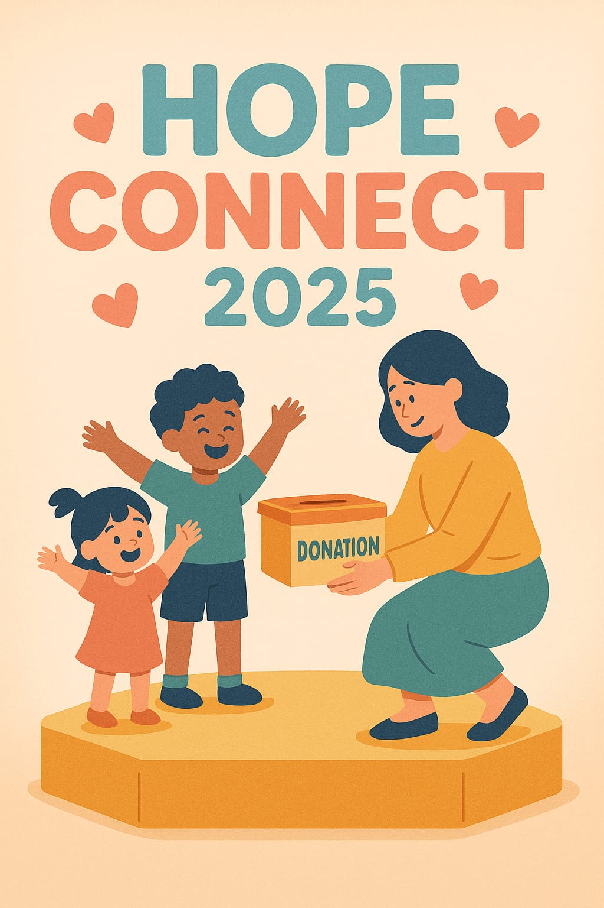
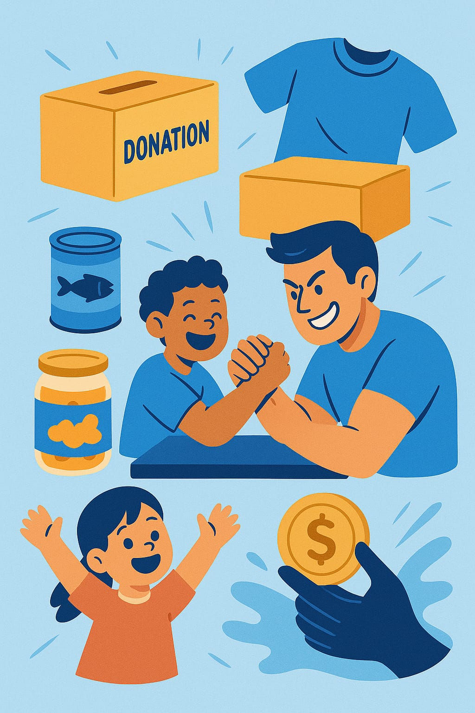

<a name="readme-top"></a>
<div align="center">
  <br>
  
</div>

<div align="center">
  <h1>HopeConnect 2025</h1>
  <p>Empowering Orphan Support through Technology</p>
  <p align="center">
    <a href="#">🚀 View Demo</a>
    &nbsp;&nbsp;&nbsp;&nbsp;&nbsp;&nbsp;&nbsp;&nbsp;
<a href="https://github.com/shahdyaseen/Advanced-Software/issues/new?fbclid=IwY2xjawGbSfVleHRuA2FlbQIxMAABHfpruLp4mAM9uicRXzYqY49NZ9hJ7s6nwmzCuvIEB-5Ytoof13P6C6TWNA_aem_REREq35TkL-EGpRyJ1EFrQ">🐞 Report Bug </a> 
 </p>
</div>

---
<br>
<div align="center">
  
</div>
<br>
<br>

<a name="intro"></a>
## 🌟 About the Project

**HopeConnect 2025** is a humanitarian web platform that connects donors, sponsors, volunteers, and orphanages. It offers a centralized system for sponsorship, donation tracking, delivery logistics, and NGO partnerships. The goal is to provide a transparent, efficient, and scalable tool for orphan support and welfare.

---

<details>
  <summary><h2>📚 Table of Contents</h2></summary>
  <ol>
    <li><a href="#intro">Introduction</a></li>
    <li><a href="#bw">Built With</a></li>
    <li><a href="#gs">Getting Started</a></li>
    <li><a href="#coref">Main Features</a></li>
    <li><a href="#roles">Roles</a></li>
    <li><a href="#API">API Documentation</a></li>
    <li><a href="#demo">Demo</a></li>
    <li><a href="#contact">Contact</a></li>
  </ol>
</details>

---

<a name="bw"></a>
## 🔨 Built With

*   
*   
*   
*   
*   

---

<a name="gs"></a>
## 🚀 Getting Started

### ⚙️ Running the project

#### 1. Clone the repository:
```bash
git clone https://github.com/yourusername/hopeconnect-2025.git
```

#### 2. Install Dependencies:
```bash
npm install
```

#### 3. Configure Environment Variables:
Rename `.env.example` to `.env` and update your database settings:
```
DB_HOST=localhost
DB_USER=root
DB_PASSWORD=yourpassword
DB_NAME=hopeconnect
JWT_SECRET=your_jwt_secret
```

#### 4. Run the Application:
```bash
npm start
```

Make sure your MySQL server is running and the database is created.

---

<a name="coref"></a>
## ⚙️ Main Features

### 🎁 Donation Management
- Add and track in-kind donations (clothes, food, supplies)
- Delivery logistics & status tracking (admin-controlled)

### 🧒 Orphan Sponsorship
- Sponsors can support orphans financially (monthly/yearly)
- Track sponsorships, view orphan profiles

### 🚚 Delivery System
- Admin can schedule & track delivery of donations
- Includes driver info, coordinates, and status

### 💸 Revenue Model & Sustainability
- Records small transaction fees on donations
- Admin can manage partners and view revenue summaries

### 🌍 Partner Integration
- Manage NGO, charity, or foundation partnerships
- Public listing & admin-level controls

---

<a name="roles"></a>
## 👥 Roles

- 👤 **Admin** – full control over platform
- 💸 **Sponsor** – provides recurring financial support
- 🎁 **Donor** – gives in-kind donations
- 🧑‍🔧 **Volunteer** – assigned to orphanage tasks

---

<a name="API"></a>
## 📡 API Documentation

All API endpoints are tested and documented using Postman.  
📄 [**Click here to view Postman Documentation**](https://documenter.getpostman.com/view/YOUR-DOC-ID)

---

<a name="demo"></a>
## 🎥 Demo

Watch the platform in action and explore the workflow.  
🔗 [**View Demo on Google Drive**]()

---

<a name="contact"></a>
## 📱 Contact

* Mohammad Khalaf – mohammadkhalaf3hfg@gmail.com  

<p align="center"><a href="https://github.com/yourusername/hopeconnect-2025/graphs/contributors">
  
</a></p>

<p align="right">(<a href="#readme-top">⬆️ Back to top</a>)</p>
